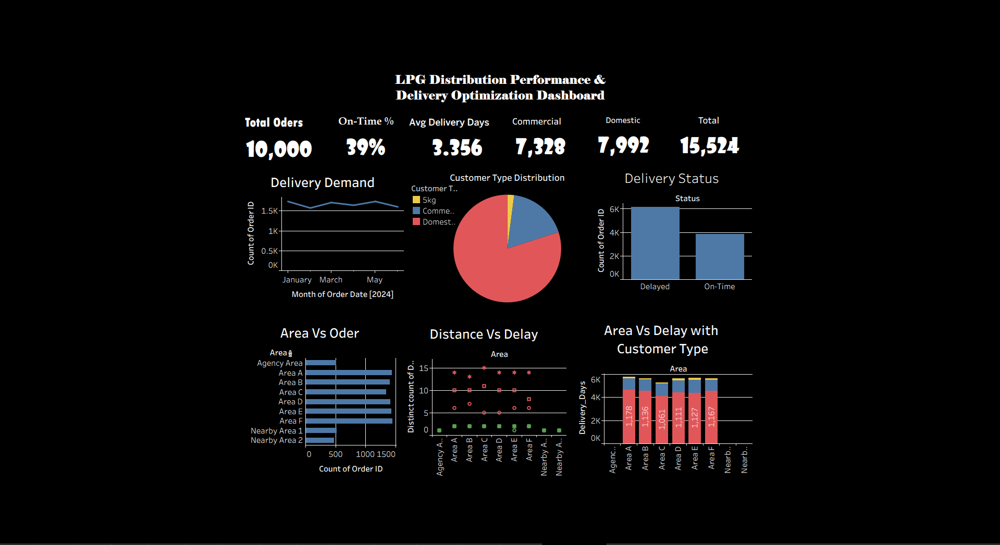

# LPG-Distribution-Analysis-Tableau
Data analysis project using Tableau to evaluate LPG distribution performance, identify delivery delays, and analyze demand variability across customer types and locations. Includes KPI tracking, logistics insights, and optimization recommendations based on real-world business scenarios.

## 📌 Project Overview
This project analyzes LPG distribution operations focusing on delivery performance, demand patterns, and logistics efficiency. The analysis is based on a realistic dataset designed using actual business constraints such as demand variability, delivery capacity, and distance-based challenges.

---

## 🎯 Business Problem
The LPG distribution system faces several operational challenges:
- Low on-time delivery rates due to high demand and limited delivery capacity
- Delays in long-distance deliveries (up to 60 km)
- Inefficient route planning and area-based delivery allocation
- Demand fluctuations during peak periods

---

## 🎯 Objective
To analyze delivery performance and identify key factors contributing to delays, and provide data-driven recommendations to improve operational efficiency.

---

## 📊 Dataset Description
The dataset contains 10,000 records simulating LPG order and delivery operations.

### Key Features:
- Order Date & Delivery Date
- Customer Type (Domestic, Commercial, 5kg)
- Delivery Type (Home / Walk-in)
- Distance (KM)
- Area-wise distribution
- Number of Cylinders
- Delivery Status (On-Time / Delayed)
- Delivery Days

---

## 📈 KPIs Tracked
- Total Orders
- On-Time Delivery %
- Average Delivery Days
- Total Cylinders Delivered
- Domestic Cylinder Volume
- Commercial Cylinder Volume
- 5kg Cylinder Volume

---

## 📊 Dashboard Insights

### 🔹 Demand Analysis
- Domestic customers contribute the majority of total orders
- Commercial orders are fewer but involve higher cylinder volumes

### 🔹 Delivery Performance
- On-time delivery rate is significantly low (~39%), indicating operational inefficiencies
- Peak demand periods increase delivery delays

### 🔹 Logistics Analysis
- Longer distances directly impact delivery delays
- Area-based delivery grouping leads to inefficiencies in route optimization

### 🔹 Customer Insights
- Walk-in customers experience no delay
- Home delivery operations are the primary source of delays

---

## 💡 Key Insights
- Distance is a major factor affecting delivery performance
- Delivery capacity is insufficient during peak demand
- Commercial deliveries are not optimally prioritized despite higher volume contribution
- Certain areas show consistently higher delays

---

## 🚀 Recommendations
- Implement route optimization for delivery vehicles
- Introduce priority-based delivery system for commercial customers
- Improve demand forecasting during peak periods
- Allocate separate delivery schedules for long-distance areas
- Increase delivery capacity during high-demand periods

---

## 🛠 Tools Used
- Tableau (Dashboard & Visualization)
- Excel (Data Preparation)

---

## 📂 Project Files
- Dataset (CSV)
- Tableau Dashboard (.twbx)
- Screenshots of Dashboard

---
## 📊 Dashboard Preview

---
## 📌 Conclusion
This project demonstrates how data-driven analysis can be used to identify inefficiencies in logistics and improve delivery performance in LPG distribution systems.

---

## 👤 Author
KIRTHIKA LAKSHMI R
